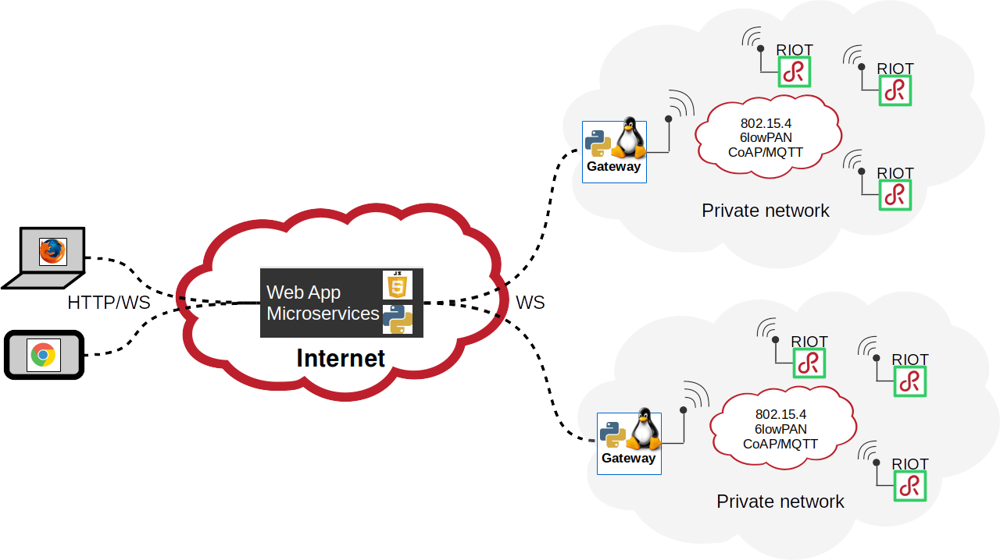
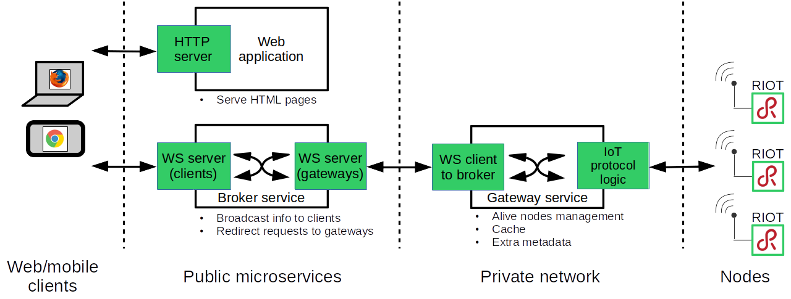

## Pyaiot, connecting nodes to the web

[](https://travis-ci.org/pyaiot/pyaiot)

Pyaiot provides a set of services for interacting and transporting data coming
from IoT nodes using regular web protocols (HTTP) and technologies. Pyaiot
relies on Python asyncio core module and on other more specific asyncio based
packages such as [Tornado](http://www.tornadoweb.org/en/stable/),
[aiocoap](http://aiocoap.readthedocs.io/en/latest/) or
[HBMQTT](http://hbmqtt.readthedocs.io/en/latest/index.html).
Pyaiot tries to only use standard protocols to connect the IoT nodes to the
web: CoAP, MQTT, HTTP, etc

### The nodes

Pyaiot main goal is to provide high level services for communicating
with **constrained** nodes.
Those nodes are generally microcontrollers and thus not able to run Linux.
Thus, we need a specific OS to run on those kind of nodes. For this, we
initially chose [RIOT](https://riot-os.org) because it provides an hardware
independent layer along with the standard network stacks required to
communicate with the nodes from a network.

The source code of RIOT firmwares running on the nodes is available in
[another repository on GitHub](https://github.com/pyaiot/riot-firmwares).

Other nodes with communication capabilities can also be used. In this
repository, we also provide a [Micropython script](utils/pycom) that can be
used on [Pycom nodes](https://www.pycom.io/).
This script only works with the [mqtt gateway service](pyaiot/gateway/mqtt).

### Available services

Pyaiot is built around several microservices:
* A public central **broker**
* A public web application for the **dashboard**
* Private distributed **gateways**



The role of the broker is to put in relation gateways and web clients in
order to be able to transfer in a bi-directionnal way messages coming from
nodes, via the gateways, to clients and vice versa.

The broker is in charge of the management of the list of gateways. The role of
the gateways is to convert protocols used by the nodes to the web protocols
used internally by Pyaiot to transfer information between the different
services. In order to guarantee reactivity and security, this internally used
protocols rely on HTTP websockets.

The Dashboard is a web page with some embbeded javascript that displays the
list of available nodes and their status. It also allows to interact with the
nodes (LED control, Robot control, etc)



3 examples of gateways are provided by pyaiot:
* A CoAP gateway that manages a list of alive sensor nodes by running it's own
CoAP server
* A MQTT gateway that manages a list of alive sensor nodes by subscribing and
publishing messages to a MQTT broker.
* A Websocket gateway dedicated to nodes: each node is connected via a
websocket

#### The CoAP gateway

Here we describe how the CoAP gateway interacts with nodes.

When a node starts, it notifies itself to its gateway by sending a CoAP
post request. On reception, the gateway converts and forwards this message to
the broker server. In the mean time, the gateway initiate a discovery of the
resources provided by the node (using the CoAP .well-known/core resource).
Once available resources on the node are known, the gateway sends to the broker
update messages.
The broker simply broadcasts those notification messages to all connected
web clients.

To keep track of alive nodes, each node has to periodically send a notification
message to its gateway.
If a sensor node has not sent this notification within 120s (default,
but this is configurable), the gateway automatically removes it from the list
of alived nodes and notifies the broker.

#### The MQTT gateway

MQTT do things differently from CoAP: the nodes and the gateway have to publish
or subscribe to topics to exchange information.

A resource discovery mechanism is also required for the gateway to determine
the list of available resources on a node. In Pyaiot, the gateway and the nodes
are used as clients of the same MQTT broker.

Since the nodes are contrained, we decided to use the
[mosquitto.rsmb broker](https://github.com/eclipse/mosquitto.rsmb). Some
documentation and a sample systemd service file is provided in the
[pyaiot/gateway/mqtt directory](./pyaiot/gateway/mqtt/systemd).

With the MQTT gateway, each node is identified by a \<node_id\> and this
identifier is used to build the topics specific to a given node.

Topics the nodes publish to/the gateway subscribes to are:
* `node/check` with payload `{'id': <node_id>}`. Once started, each node
  publishes periodically (every 30s) on this topic.
* `node/<node_id>/resources` with payload `[<resource 1>, <resource 1>]`. This
comes as a reply to the gateway request for resources available on a given node.
* `node/<node_id>/<resource>` with payload `{'value': <resource_value>}`.
Depending on the type of resource, a node can publish periodically or not or on
demand on this topic.

Topics the nodes subscribe to/the gateway publishes to are:
* `gateway/<node_id>/discover` with 2 possible payloads:
  * `resources`: then the node publish on `node/<node_id>/resources`
  * `values`: then, for each resource, the node publish on
    `node/<node_id>/<resource>`
* `gateway/<node_id>/<resource>/set` with a payload depending on the resource:
  update the value of the resource on the node (LED toggle, text, etc)

#### The websocket gateway

The behavior with a websocket gateway is similar to the CoAP gateway except
that the node doesn't have to send notifications periodically: the node is lost
when the connection is closed.

#### Security

A basic authentication mecanism based on symmetric cryptography exists between
the broker and gateways. This prevents unwanted gateways to connect to your
broker.

Before any installation, a pair of keys needs to be generated using the
provided tool `aiot-generate-keys`:

```
    bin/aiot-generate-keys
```

The tool writes the keys in the user home directory in `~/pyaiot/keys`.
By default, the broker and gateway services look in this location but one can
specify custom key file with the `--key-file` option when starting the
services.

Thanks to this, you can have gateways on different hosts connecting in a
secured way to your central broker.
The important thing is to have your broker reachable from the gateways and
clients.

### Available Demos

See Pyaiot in action within 2 demos:
* [RIOT](http://riot-os.org): You can find a permanent demo instance configured
  as a showroom for RIOT. This showroom is available at
  http://riot-demo.inria.fr.

* [IoT-LAB open A8 demo](utils/iotlab)
  This demo automatically submits an experiment on IoT-LAB with two open A8
  nodes. The first node is configured as a border router and the second node
  runs a firmware that integrates automatically in the RIOT Demo Dashboard
  described above.

### Installation procedure on a standalone system:

Here are the steps to install Pyaiot on a standalone system. The final
setup will be as follows:
* `aiot-broker` and `aiot-dashboard` running as systemd services
* the `aiot-broker` websocket server listening on port 8082
* the `aiot-dashboard` web application listening on port 8080. All served pages
  open a websocket client on the port 8082 of the broker
* the `aiot-coap-gateway` listening on UDP 5683 CoAP port
* the `aiot-ws-gateway` websocket server listening on port 8083

The gateway services are optional.

For a custom setup, please edit the `Environment` option of the
[aiot-broker](systemd/aiot-broker.service),
[aiot-dashboard](systemd/aiot-dashboard.service),
[aiot-coap-gateway](systemd/aiot-coap-gateway.service) and
[aiot-ws-gateway](systemd/aiot-ws-gateway.service) systemd service files
**before** deploying. The broker port should be the same in both service files
if you want them to work together.

Here are the installation steps:

1. Clone this repository
<pre>
    $ git clone https://github.com/pyaiot/pyaiot.git
</pre>
2. Deploy the system (works for debian/raspbian/ubuntu):
<pre>
    $ make deploy
</pre>
3. Verify that the services are correctly running:
<pre>
    $ sudo systemctl status aiot-broker.service
    ● aiot-broker.service - Pyaiot Broker Application
       Loaded: loaded (/lib/systemd/system/aiot-broker.service; enabled)
       Active: active (running) since dim. 2016-12-18 14:59:56 CET; 35min ago
     Main PID: 32411 (python3)
       CGroup: /system.slice/aiot-broker.service
               └─32411 /usr/bin/python3 /usr/local/bin/aiot-broker --port=8082 --debug
    [...]
    $ sudo systemctl status aiot-dashboard.service
    ● aiot-dashboard.service - Pyaiot Dashboard Application
       Loaded: loaded (/lib/systemd/system/aiot-dashboard.service; enabled)
       Active: active (running) since dim. 2016-12-18 14:52:29 CET; 41min ago
     Main PID: 32321 (python3)
       CGroup: /system.slice/aiot-dashboard.service
               └─32321 /usr/bin/python3 /usr/local/bin/aiot-dashboard --port=8080 --broker-port=8082 --broker...
    [...]
</pre>
4. Deploy a coap gateway (optional):
<pre>
    $ make setup-coap-gateway-service
</pre>
5. Deploy a ws gateway (optional):
<pre>
    $ make setup-ws-gateway-service
</pre>

You can also update the `Environment` option in the services definition files
**after** deployment. The services files are located in `/lib/systemd/system.
Note that you'll have to reload the systemd daemon services and restart
services:
```
    $ sudo systemctl daemon-reload
    $ sudo systemctl restart aiot-broker
    $ sudo systemctl restart aiot-dashboard
    $ sudo systemctl restart aiot-coap-gateway-service
    $ sudo systemctl restart aiot-ws-gateway-service
```

_**Example**_: Environments used in the online RIOT demo
* aiot-broker:
```
Environment='BROKER_PORT=8082'
```
* aiot-dashboard:
```
Environment='STATIC_PATH=/home/pi/demos/pyaiot/dashboard/static' \
        'HTTP_PORT=8080' \
        'BROKER_PORT=80' \  # This is because the broker is behind an apache proxy
        'BROKER_HOST=riot-demo.inria.fr' \
        'APP_TITLE=RIOT Demo Dashboard' \
        'APP_LOGO=/static/assets/logo-riot.png' \
        'APP_FAVICON=/static/assets/favicon192.png'
```
* aiot-coap-gateway:
```
Environment='BROKER_HOST=riot-demo.inria.fr' \
            'BROKER_PORT=80'
```
* aiot-ws-gateway:
```
Environment='BROKER_HOST=riot-demo.inria.fr' \
            'BROKER_PORT=80' \
            'GATEWAY_PORT=8083'
```

### Dashboard local development against an external IoT broker instance

Here we take as example the online demo available at http://riot-demo.inria.fr.
The websocket server of the broker service is reachable on port 80.
As the broker and the dashboard are decoupled in 2 distinct services,
it's possible to run a local dashboard application serving dashboard web page
that itself connects to the broker.
This way your dashboard will display the available nodes on the online RIOT
demo.

In this configuration, you don't need to install all the services but you still
need to install the required development dependencies the first time:
```
    $ make install-dev
```

Then you can start the dashboard application:
```
    $ make run-dashboard
```
and open a web browser at [http://localhost:8080](http://localhost:8080).
When the web page is loaded, thanks to its embedded javascript, it directly
connects to the broker websocket server and starts to communicate with the
nodes.

Of course the default environment variables can be changed in order to fit your
needs:
`BROKER_PORT`, `BROKER_HOST`, `DASHBOARD_PORT`, `DASHBOARD_TITLE`,
`DASHBOARD_LOGO`, `DASHBOARD_FAVICON`, `CAMERA_URL`.

```
    $ BROKER_PORT=8082 BROKER_HOST=localhost make run-dashboard
```
